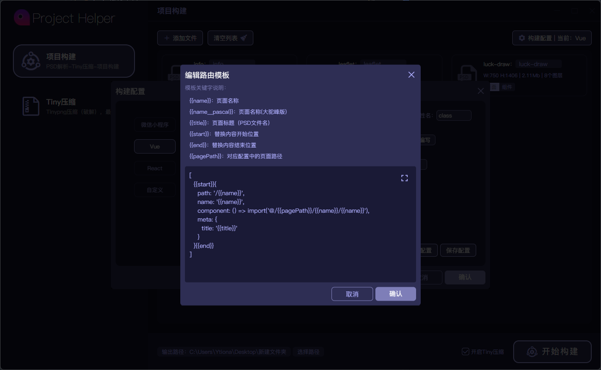
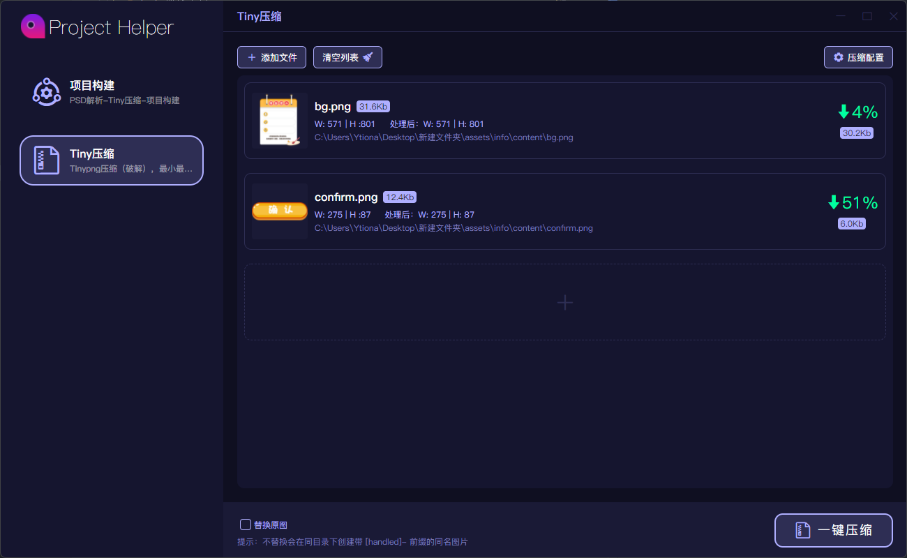

## 项目助手 | Project Helper
> Coded in 2022.04；\
> 从0到1，独立完成；\
> 产品设计->UI设计->开发。

### 基于electron开发的桌面应用程序，顾名思义，是一个项目助手工具。

#### 目前功能：
* psd文件解析，生成html和css；
* 项目构建，及其模板配置（预设有vue、react、微信小程序）；
* 图片压缩（tinypng破解），本地图片预处理等；

#### 技术栈关键词：
* electron
* vue3
* nodejs
* psdjs（psd解析插件）
* jimp（图片处理插件）
* tinypng（破解频率限制）
* pinia（额外写了一个持久化的插件）
* lodash
* iconfont（字体图标）
* vite

> 以下已勾选的则是已完成内容

### PSD解析模块:
- [x] 文件体积
- [x] 宽高读取
- [x] 图层数统计
- [x] 图层导出png图片

### 项目构建模块:
- [x] 页面/组件名称配置
- [x] 输出目录配置
- [x] 集成tiny压缩
- [x] html生成
- [x] css生成
- [x] 类型控制：页面、组件
- [x] 构建配置：css单位
- [x] 构建配置：容器标签
- [x] 构建配置：图片标签
- [x] 构建配置：类属性名及css选择器
- [x] 构建配置：路由生成配置
- [x] 构建配置：页面路径、组件路径、图片路径
- [x] 构建配置：页面/组件文件配置，及模板内容
- [x] 构建配置：容器标签
- [x] 构建配置：容器标签
- [x] 构建预设：vue
- [x] 构建预设：react
- [x] 构建预设：微信小程序
- [x] 自定义构建预设
- [x] 配置持久化
- [ ] 单个文件的构建和压缩loading
- [ ] 构建结果报告（用时、构建产物体积等）

### Tiny压缩模块:
- [x] 可控替换原图
- [x] 图片信息：体积、名称、路径、宽高
- [x] 本地预处理：最大宽度
- [x] 本地预处理：最大高度
- [x] 本地预处理：图片质量
- [x] Tinypng频率限制破解
- [x] Tiny配置：最小体积
- [x] Tiny配置：最大体积
- [x] 压缩结果，压缩比例
- [x] 配置持久化
- [ ] 压缩结果报告（用时、缩小体积等）

### 文件选取模块：
- [x] 添加文件
- [x] 清空列表
- [x] 单个移除
- [ ] 拖拽上传
- [ ] 文件夹读取

### 基础组件：
- [x] button
- [x] checkbox
- [x] input
- [x] message
- [x] modal
- [x] notice
- [ ] poptip
- [ ] slide

项目构建-初始

项目构建-选取ps文件后

项目构建-构建配置

构建配置-路由模板编辑

构建配置-页面文件编辑

Tiny压缩-初始

Tiny压缩-选取图片后

Tiny压缩-配置

Tiny压缩-压缩中

Tiny压缩-压缩结果

